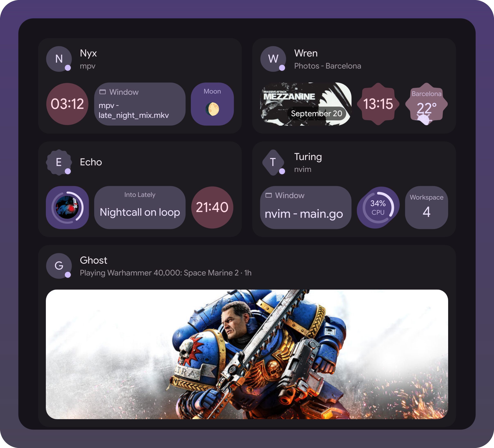
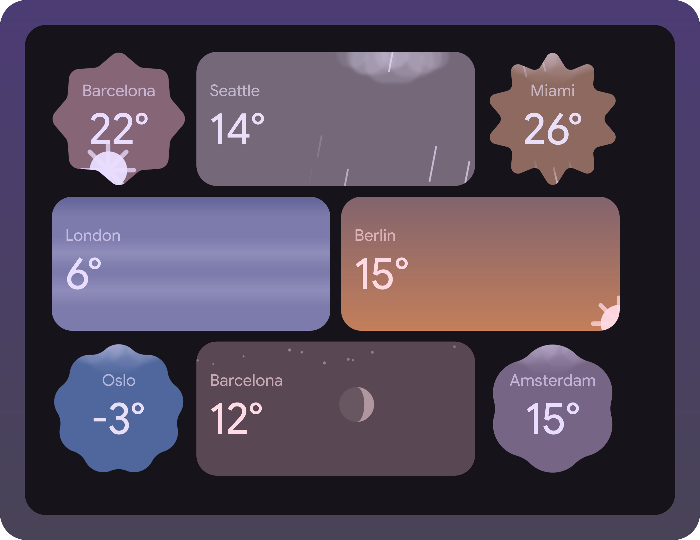
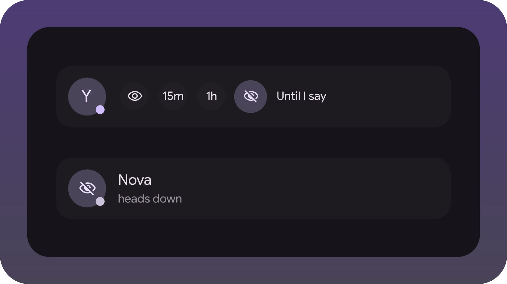
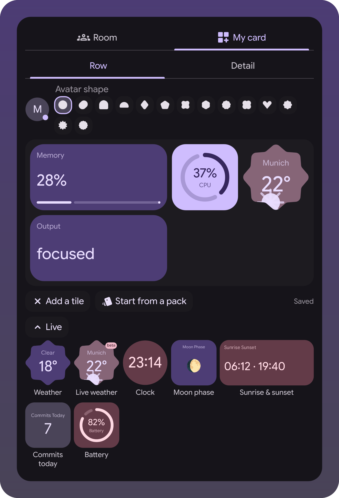
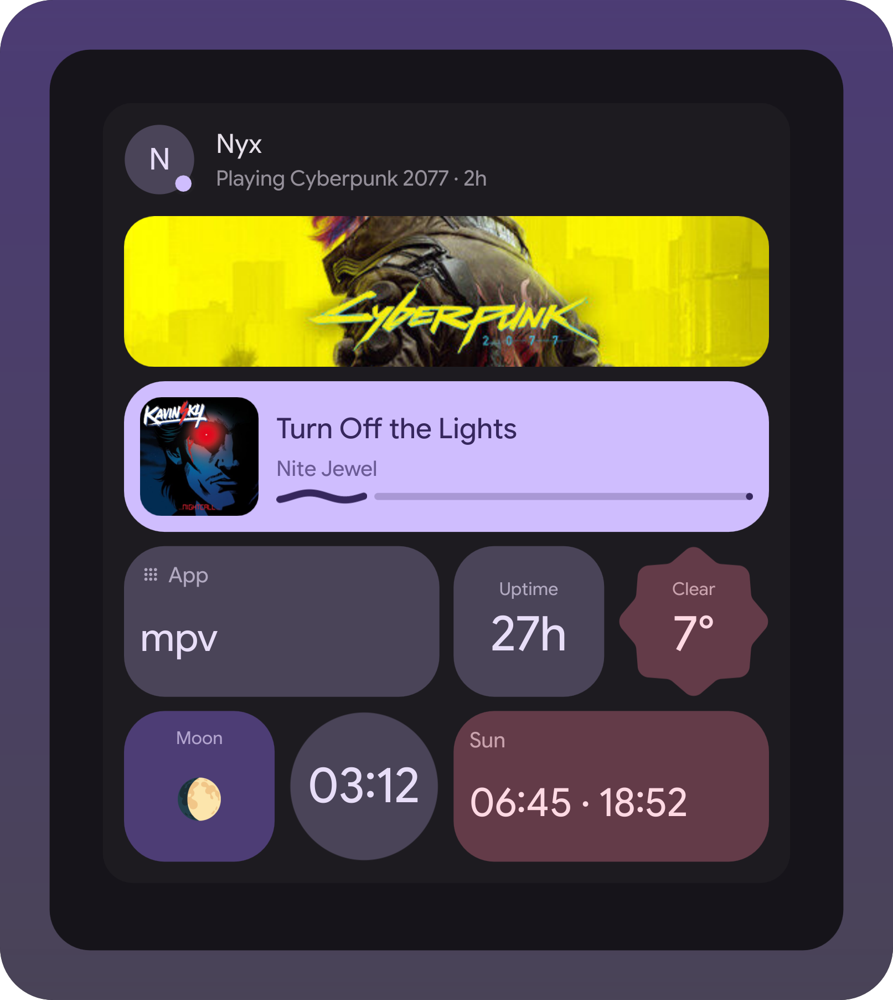
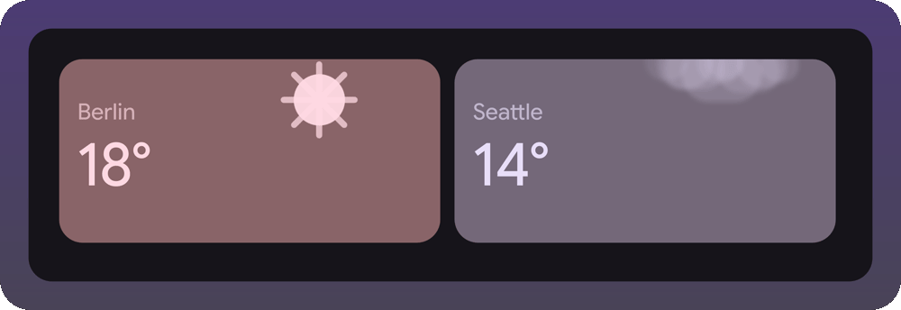

# Statusphere widget

A room of friends on your desktop: who's online, what they're playing, photos they
shared. Client for [statusphere](https://github.com/MAX1T1A/statusphere), and the first
widget living outside the shell tree - a trial run of the extensions mechanism in the
[illogical-impulse extensions fork](https://github.com/Berupor/dots-hyprland-extensions).



Nobody in that room is real: the scenes in `demo/` feed the widget made-up members
through the same `ingest` the cli talks to.

<table>
<tr>
<td align="center" width="50%">
<br>
<sub>Clear, rain, thunder, snow, fog, a sunset, night with the moon</sub>
</td>
<td align="center" width="50%">
<br>
<sub>Sliding into hiding, and how it looks to everyone else</sub>
</td>
</tr>
<tr>
<td align="center">
<br>
<sub>Building a card from the live tile gallery</sub>
</td>
<td align="center">
<br>
<sub>A night owl's card, close up</sub>
</td>
</tr>
</table>

<p align="center">
<br>
<sub>The same live tiles, moving: the sun runs its arc through sunset, past it into night with the moon, and back round to noon, rain keeps falling</sub>
</p>

## Install

Settings → Widgets → Install a widget, paste:

```
https://github.com/Berupor/ii-widget-statusphere.git
```

Needs `~/.local/bin/statusphere` logged in, otherwise the widget stays greyed out.

## Hacking

With the fork checked out next door, the scenes are both the tests and the pictures:

```sh
tests/qml-cases.sh    -x ~/.config/illogical-impulse/widgets/statusphere
tests/widget-shots.sh -x ~/.config/illogical-impulse/widgets/statusphere
tests/widget-gif.sh                                   # redraws docs/weather.gif
```

`git config core.hooksPath .githooks` runs them on push. GPL-3.0.
