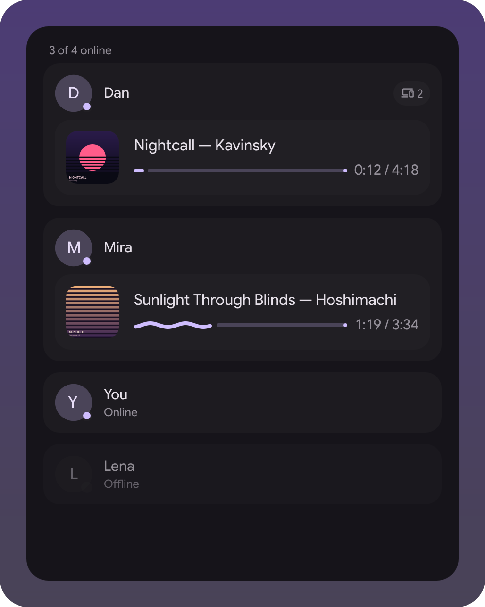
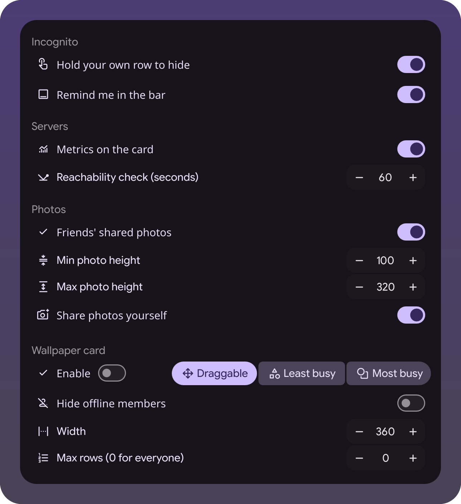

# Statusphere widget

A room of friends on your desktop: who's online, what they're playing, photos they
shared. Client for [statusphere](https://github.com/MAX1T1A/statusphere), and the first
widget living outside the shell tree - a trial run of the extensions mechanism in the
[illogical-impulse extensions fork](https://github.com/Berupor/dots-hyprland).

| The room | Its settings |
|---|---|
|  |  |

Nobody in that room is real: the scenes in `demo/` feed the widget made-up members
through the same `ingest` the cli talks to.

## Install

Settings → Widgets → Install a widget, paste:

```
https://github.com/Berupor/ii-widget-statusphere.git
```

Needs `~/.local/bin/statusphere` logged in, otherwise the widget stays greyed out.

## Hacking

With the fork checked out next door, the scenes are both the tests and the pictures:

```sh
tests/qml-cases.sh    -x ~/.config/illogical-impulse/widgets/statusphere
tests/widget-shots.sh -x ~/.config/illogical-impulse/widgets/statusphere
```

`git config core.hooksPath .githooks` runs them on push. GPL-3.0.
